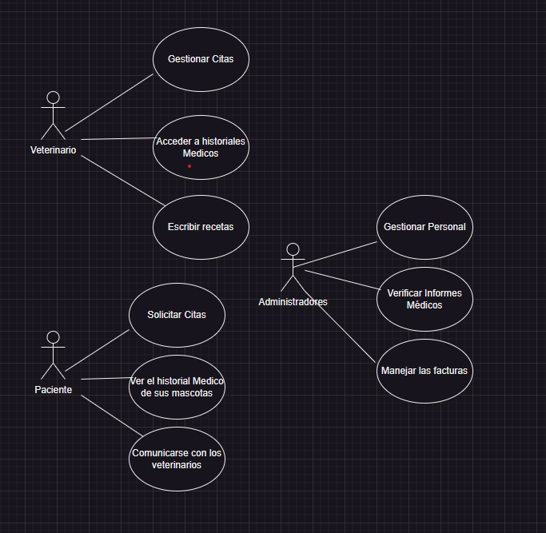

# DARIORETO
## Índice

* Documentación de la Aplicacion de Gestión Veterinaria
   - [Índice](README.md)
   - [Introducción](#Introducción)
   - [Instalación](#instalación)
   - [Uso](#Uso)
   - [Contribución](#Contribución)
   - [Subvención](#Subvención)

## Introducción

El sistema de Gestión Veterinaria desarrollado por el alumnado del **IES MIGUEL Herrero Pereda** permite a pacientes, médicos y administradores gestionar las operaciones basicas de un centeo veterinario de forma segura y eficiente.

## Instalación

Para instalar y configurar la aplicación en tu entorno local, sigue los siguientes pasos:

1. Clona el repositorio desde GitHub:

          [git clone] (https://github.com/darioobg/darioRETO)
        
2. Abre el proyecto en tu entorno de desarrollo preferido (VSCode, IntelliJ...).

3. Compila y ejecuta el proyecto.

## Uso

 El sistema veterinario incluye las siguientes funcionalidades principales:
* Solicitud y gestion de citas.
* Acceso y consulta del historial clinico.
* Comunicacion entre pacientes y profesionales.
* Gestion de recetas electronicas. 
* Administracion del personal.
* Revision de informes.
* Gestion de facturas.

Para utilizar la aplicacion, sigue las instrucciones proporcionadas en la interfaz de usuario o consulta la documentacion del usuario incluida en el repositorio.

A continuacion se detalla la funcion dentro del sistema cada uno de los usuarios:

**Usuario       Funcionalidad**
______________________________________________________________________________

Paciente        Solicita citas, accede a su historial, contacta con el medico.
______________________________________________________________________________

Veterinacrio    Gestiona citas, consulta historiales, emite recetas.
______________________________________________________________________________

Administrador   Administra personal, informes y facturacion.
________________________________________________________________________________
Lo representamos a t ravés del siguiente diagrama de casos de uso:

 

## Contribución

¿Quieres colaborar en el desarrollo?

1. Haz un fork del repositorio.
2. Crea una nueva rama (git checkout -b feature/tu-mejora).
3. Realiza tus cambios y haz commit(git commit -am 'Agrega nueva funcionalidad').
4. Haz push a la rama(git push origin feature/nueva-funcionalidad).
5. Abre un pull request su revisión.

## Subvención

Este proyecto esta subvencionado por el [Gobierno de españa](https://www.lamoncloa.gob.es/Paginas/index.aspx)

-------------------------------------------------------------------------------------------

Para obtener mas informacion sobre la aplicacion y su funcionamiento interno, consulta nuestra [documentacion tecnica](documentacionTecnica.docx)

Otros organismos colaboradores:

